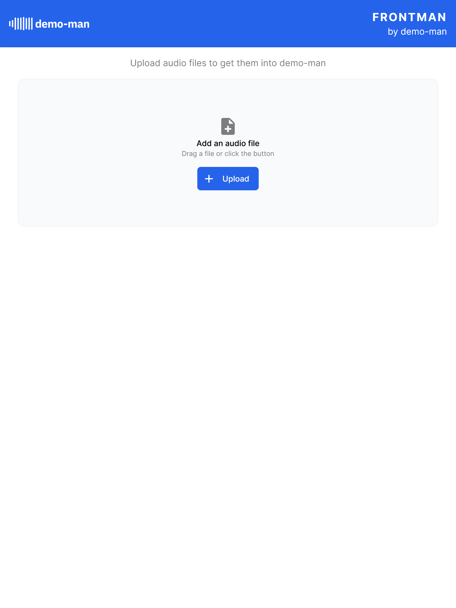
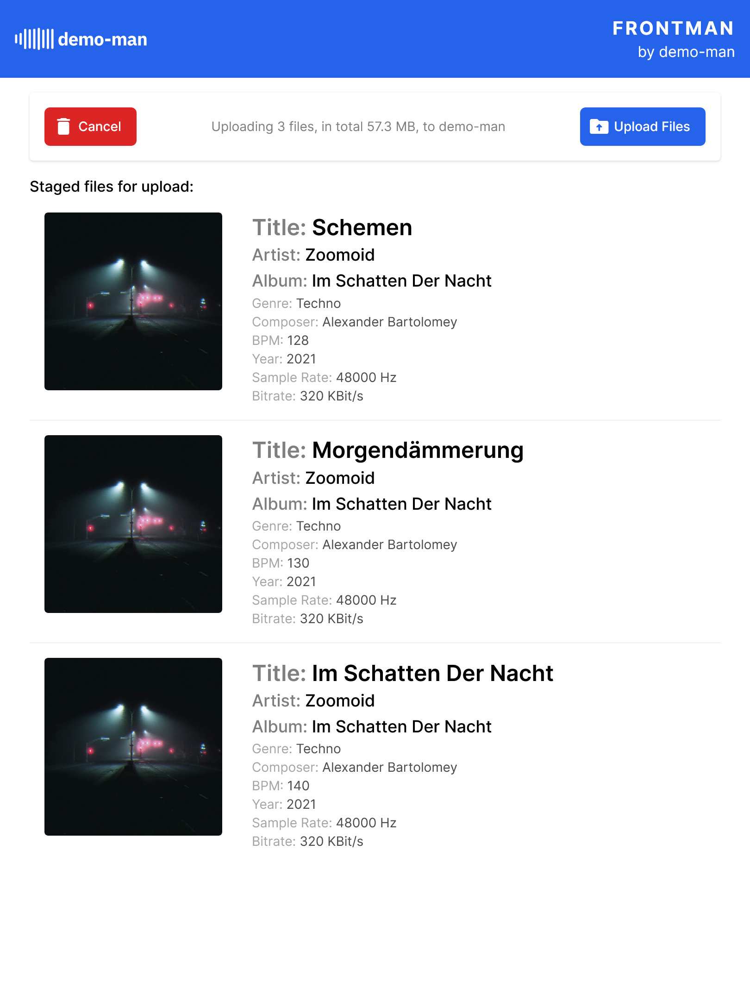

# `demo-man/frontman`

`frontman` is a micro-frontend written in Vue 3 with Vite to select, preview, and upload files to demo-man.
`frontman` performs client-side analysis of the MP3 files such that we save up on server-side processing,
and, more importantly, requesting files from the S3 storage bucket only for processing (as audio files are rather large,
requesting them often will inevitably drive up costs).

`frontman` uses the same library for analysis that `watchdog` does, but in the browser, which means it can interact directly with
the demo-man API server and push new audio files there without having to take the detour via `watchdog`.

> This service superseeds the `watchdog` in v2 of demo-man, hence it is the primary focus of development instead of maintaining `watchdog`.

> NOTE that this project is still in the early development stages, as we learn Vue 3 and in particular the quirks of 
> `<script setup>` with TypeScript. It is far from ready yet and most importantly, **still has to undergo authentication
> considerations**.

